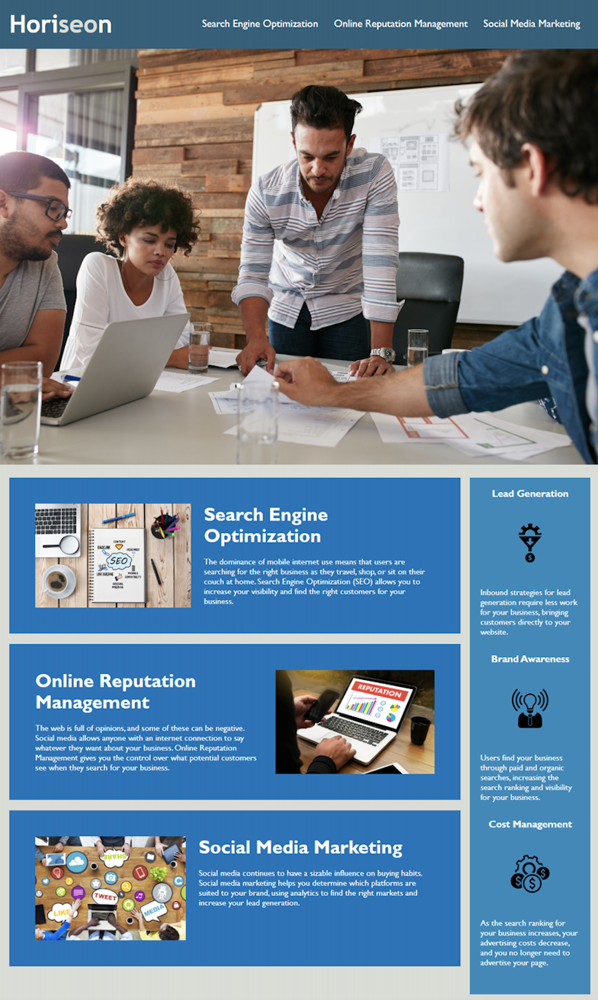

## Horiseon-Marketing-Refactor

# Existing codebase for a marketing website was refactored to increase accessibility by adding html semantic elements and adding aaccessible alt attributes to icon and image elements. Furthermore, the codebase was cleaned up to follow a more logical sequential order of heading attributes and html elements. 

# Screenshot 

# Link to deployed application

